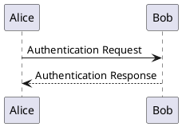
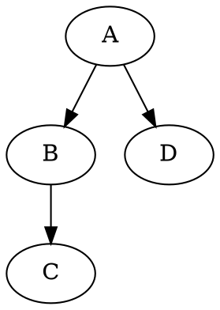
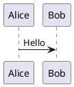
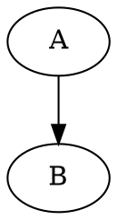

# MXE Feature Research Report

**Date:** 2026-02-08  
**Purpose:** Comprehensive analysis of features to add to MXE markdown-to-PDF/HTML tool

---

## Table of Contents

1. [Current MXE Features](#current-mxe-features)
2. [Competitor Analysis](#competitor-analysis)
3. [Diagram Types Research](#diagram-types-research)
4. [Document Features](#document-features)
5. [Technical Features](#technical-features)
6. [Developer Experience](#developer-experience)
7. [Priority Matrix](#priority-matrix)
8. [Top 10 Recommended Features](#top-10-recommended-features)

---

## Current MXE Features

MXE v2.1.1 currently supports:

| Feature | Status |
|---------|--------|
| Mermaid diagrams (inline SVG) | ✅ |
| WaveDrom timing diagrams | ✅ |
| Table of Contents | ✅ |
| PDF bookmarks | ✅ |
| Code syntax highlighting | ✅ |
| Custom fonts (Google Fonts) | ✅ |
| Image embedding (base64) | ✅ |
| Hand-drawn diagram style | ✅ |
| URL-to-Markdown conversion | ✅ |
| Multiple output formats (PDF, DOCX, HTML) | ✅ |

---

## Competitor Analysis

### 1. Pandoc

**The Swiss Army Knife of document conversion**

| Feature | Pandoc | MXE |
|---------|--------|-----|
| Input formats | 40+ (docx, latex, rst, org, etc.) | Markdown only |
| Output formats | 60+ | PDF, DOCX, HTML |
| **Template system** | ✅ Full template engine | ❌ |
| **Variables/frontmatter** | ✅ YAML metadata | ❌ |
| **Citations/bibliography** | ✅ CSL, BibTeX, natbib | ❌ |
| **Cross-references** | ✅ pandoc-crossref | ❌ |
| **Include files** | ✅ `--include-in-header` | ❌ |
| **Filters/plugins** | ✅ Lua, Python, JSON | ❌ |
| **Defaults file** | ✅ YAML config | ❌ |
| **Footnotes/endnotes** | ✅ Native | ❌ |
| LaTeX math | ✅ | ❌ |
| Slide presentations | ✅ reveal.js, beamer | ❌ |

**Key features MXE lacks:**
- Template system with variable substitution
- Citations and bibliography
- Config file support (`--defaults`)
- Include/import other files
- Cross-references between sections

### 2. md-to-pdf (npm)

**Closest competitor - Node.js based**

| Feature | md-to-pdf | MXE |
|---------|-----------|-----|
| **Config file** | ✅ `.md2pdf.js` | ❌ |
| **Watch mode** | ✅ `--watch` | ❌ |
| **Gray-matter frontmatter** | ✅ Full YAML | ❌ |
| **CSS preprocessors** | ✅ SASS, Less | ❌ |
| **Programmatic API** | ✅ Library mode | ❌ |
| **Headers/footers** | ✅ HTML templates | ❌ |
| **Page numbers** | ✅ CSS counters | ❌ |
| Mermaid | Via plugin | ✅ Native |
| Puppeteer-based | ✅ | ✅ |

**Key features MXE lacks:**
- Watch mode for auto-rebuild
- Config file support
- Frontmatter variables
- Library/API mode
- Headers and footers

### 3. Typst

**Modern LaTeX replacement - emerging competitor**

| Feature | Typst | MXE |
|---------|-------|-----|
| Native language | Custom | Markdown |
| **Scripting** | ✅ Built-in | ❌ |
| **Templates** | ✅ Functions | ❌ |
| **Variables** | ✅ Native | ❌ |
| **Cross-references** | ✅ `@label` | ❌ |
| **Bibliography** | ✅ Hayagriva, BibTeX | ❌ |
| **Data loading** | ✅ JSON, CSV, XML | ❌ |
| **Introspection** | ✅ Self-aware docs | ❌ |
| Compilation speed | Very fast | Moderate |

**Key insight:** Typst is gaining traction in academia as LaTeX alternative.

### 4. WeasyPrint

**Professional PDF generation from HTML/CSS**

| Feature | WeasyPrint | MXE |
|---------|------------|-----|
| **@page CSS rules** | ✅ Full support | Limited |
| **Headers/footers** | ✅ Running elements | ❌ |
| **Page numbers** | ✅ CSS counters | ❌ |
| **Watermarks** | ✅ Background images | ❌ |
| **Multi-column** | ✅ CSS columns | ❌ |
| **Page breaks** | ✅ Fine control | Limited |
| **Bookmarks** | ✅ Native | ✅ |
| **PDF/A compliance** | ✅ | ❌ |

**Key features MXE lacks:**
- Headers/footers via CSS @page
- Page numbers
- Watermarks
- Multi-column layouts

### 5. PrinceXML

**Commercial, gold standard for CSS-to-PDF**

Notable features:
- Footnotes/endnotes
- Cross-references
- Leaders (for TOC dots)
- Advanced typography
- Page floats
- Multi-column
- PDF/A, PDF/X compliance

### 6. Notion Export

**User-facing document tool**

| Feature | Notion | MXE |
|---------|--------|-----|
| Export formats | PDF, HTML, Markdown | PDF, DOCX, HTML |
| Include subpages | ✅ | ❌ |
| **Databases** | ✅ Tables, views | ❌ |
| **Page comments** | ✅ Exportable | ❌ |
| Collaboration | ✅ | ❌ |

### 7. Obsidian Publish/Export

| Feature | Obsidian | MXE |
|---------|----------|-----|
| **Wiki-links** | ✅ `[[link]]` | ❌ |
| **Backlinks** | ✅ | ❌ |
| **Graph view** | ✅ | ❌ |
| **Callouts** | ✅ `> [!note]` | ❌ |
| **Embeds** | ✅ `![[file]]` | ❌ |
| Local-first | ✅ | ✅ |

---

## Diagram Types Research

### Current Support

| Diagram Type | MXE | Notes |
|--------------|-----|-------|
| Mermaid | ✅ | Full support |
| WaveDrom | ✅ | Timing + registers |

### Recommended Additions

#### 1. PlantUML (HIGH PRIORITY ⭐⭐⭐)

**Why:** Most comprehensive UML tool, widely used in enterprise

**Supported diagrams:**
- Sequence diagrams (more powerful than Mermaid)
- Class diagrams
- Use case diagrams
- Activity diagrams
- Component/deployment diagrams
- State diagrams
- Object diagrams
- **Gantt charts**
- **Mind maps**
- **JSON/YAML visualization**
- **Network diagrams (nwdiag)**
- **ER diagrams**
- **Math (AsciiMath, LaTeX)**

**Implementation options:**
1. **Kroki API** (recommended) - single endpoint for 20+ diagram types
2. Local PlantUML server (Docker)
3. Direct Java integration

**Example syntax:**


#### 2. GraphViz/DOT (MEDIUM PRIORITY ⭐⭐)

**Why:** Industry standard for graph visualization

**Use cases:**
- Dependency graphs
- State machines
- Network topologies
- Org charts
- Call graphs

**Example:**


#### 3. Vega-Lite (HIGH PRIORITY ⭐⭐⭐)

**Why:** Best-in-class data visualization

**Chart types:**
- Bar, line, area, scatter
- Histograms
- Box plots
- Heatmaps
- Geographic maps
- Multi-view compositions

**Example:**
```vega-lite
{
  "data": {"values": [{"a": "A", "b": 28}]},
  "mark": "bar",
  "encoding": {
    "x": {"field": "a", "type": "nominal"},
    "y": {"field": "b", "type": "quantitative"}
  }
}
```

#### 4. D2 (MEDIUM PRIORITY ⭐⭐)

**Why:** Modern, fast, beautiful diagrams

**Unique features:**
- Sketch mode (hand-drawn)
- Animations
- Multiple layout engines
- Dark mode adaptive
- LaTeX support

**Example:**
```d2
server -> database: query
database -> server: results
```

#### 5. Excalidraw (LOW PRIORITY ⭐)

**Why:** Hand-drawn aesthetic, very popular

**Consideration:** JSON-based, larger payloads

#### 6. Kroki Integration (RECOMMENDED APPROACH ⭐⭐⭐)

**One API for 25+ diagram types:**

| Diagram Type | Kroki |
|--------------|-------|
| BlockDiag | ✅ |
| BPMN | ✅ |
| Bytefield | ✅ |
| C4 (PlantUML) | ✅ |
| D2 | ✅ |
| DBML | ✅ |
| Ditaa | ✅ |
| Erd | ✅ |
| Excalidraw | ✅ |
| GraphViz | ✅ |
| Mermaid | ✅ |
| Nomnoml | ✅ |
| Pikchr | ✅ |
| PlantUML | ✅ |
| Structurizr | ✅ |
| Svgbob | ✅ |
| Symbolator | ✅ |
| TikZ | ✅ |
| UMlet | ✅ |
| Vega | ✅ |
| Vega-Lite | ✅ |
| WaveDrom | ✅ |
| WireViz | ✅ |

**Implementation:** Single integration, many diagram types

---

## Document Features

### 1. Headers & Footers (HIGH PRIORITY ⭐⭐⭐)

**Use cases:**
- Document title in header
- Page numbers in footer
- Company logo
- Date/version info
- Chapter names

**Implementation approaches:**

**A. Puppeteer native (recommended):**
```javascript
await page.pdf({
  displayHeaderFooter: true,
  headerTemplate: '<div style="font-size: 10px;">My Document</div>',
  footerTemplate: `
    <div style="font-size: 10px; width: 100%; text-align: center;">
      Page <span class="pageNumber"></span> of <span class="totalPages"></span>
    </div>
  `,
  margin: { top: '1in', bottom: '1in' }
});
```

**Available placeholders:**
- `<span class="date"></span>`
- `<span class="title"></span>`
- `<span class="url"></span>`
- `<span class="pageNumber"></span>`
- `<span class="totalPages"></span>`

**B. CSS @page rules (WeasyPrint style):**
```css
@page {
  @top-center { content: "Document Title"; }
  @bottom-right { content: "Page " counter(page) " of " counter(pages); }
}
```

### 2. Page Numbers (HIGH PRIORITY ⭐⭐⭐)

**Options:**
- Bottom center (most common)
- Bottom right (academic)
- Header position
- "Page X of Y" format
- Roman numerals for front matter

**CLI option proposal:**
```bash
mxe doc.md --page-numbers bottom-center
mxe doc.md --page-numbers "Page {page} of {pages}"
```

### 3. Cover Page / Title Page (HIGH PRIORITY ⭐⭐⭐)

**Content:**
- Title
- Author(s)
- Date
- Version
- Abstract
- Logo

**Implementation via frontmatter:**
```yaml
---
title: My Document
author: John Doe
date: 2024-02-08
version: 1.0
cover: true
logo: ./logo.png
---
```

**CLI option:**
```bash
mxe doc.md --cover --title "My Report" --author "John Doe"
```

### 4. Watermarks (MEDIUM PRIORITY ⭐⭐)

**Use cases:**
- "DRAFT" overlay
- "CONFIDENTIAL"
- Company logo background
- "DO NOT DISTRIBUTE"

**Implementation:**
```css
@page {
  background-image: url('watermark.png');
  background-repeat: no-repeat;
  background-position: center;
  background-size: 50%;
  opacity: 0.1;
}
```

**CLI option:**
```bash
mxe doc.md --watermark "DRAFT"
mxe doc.md --watermark ./logo.png --watermark-opacity 0.1
```

### 5. Multi-Column Layouts (LOW PRIORITY ⭐)

**Use cases:**
- Newsletters
- Academic papers (two-column)
- Magazine layouts

**CSS approach:**
```css
.two-column {
  column-count: 2;
  column-gap: 20px;
}
```

### 6. Footnotes/Endnotes (MEDIUM PRIORITY ⭐⭐)

**Markdown-it plugin exists:** `markdown-it-footnote`

**Syntax:**
```markdown
Here is a footnote reference[^1].

[^1]: This is the footnote content.
```

### 7. Citations/Bibliography (MEDIUM PRIORITY ⭐⭐)

**Standards:**
- CSL (Citation Style Language)
- BibTeX
- Hayagriva (Typst)

**Use cases:**
- Academic papers
- Research reports
- Technical documentation

**Implementation complexity:** HIGH - requires citation processor

### 8. Cross-References (MEDIUM PRIORITY ⭐⭐)

**Syntax proposal:**
```markdown
See [Section](#heading-id) for details.
See [Figure 1](#fig-1) for the diagram.
As shown in {@fig:diagram}...
```

### 9. Custom CSS Themes (LOW PRIORITY ⭐)

**Built-in theme options:**
- Default (current)
- Academic
- Technical
- Modern
- Print-friendly

---

## Technical Features

### 1. Watch Mode (HIGH PRIORITY ⭐⭐⭐)

**Use case:** Live preview during writing

**Implementation:**
```javascript
import chokidar from 'chokidar';

const watcher = chokidar.watch(inputFile, {
  persistent: true,
  ignoreInitial: true
});

watcher.on('change', async () => {
  console.log('File changed, rebuilding...');
  await convert(inputFile, options);
});
```

**CLI:**
```bash
mxe doc.md --watch
mxe doc.md -w --open  # Open in browser and auto-refresh
```

### 2. Config File Support (HIGH PRIORITY ⭐⭐⭐)

**File:** `.mxerc`, `.mxerc.json`, `mxe.config.js`

**Example `.mxerc.json`:**
```json
{
  "format": "pdf",
  "font": "inter",
  "monoFont": "fira-code",
  "toc": true,
  "tocDepth": 3,
  "bookmarks": true,
  "pageNumbers": "bottom-center",
  "headerTemplate": "<div>My Company</div>",
  "footerTemplate": "<div>Page <span class='pageNumber'></span></div>",
  "margin": {
    "top": "1in",
    "bottom": "1in",
    "left": "0.75in",
    "right": "0.75in"
  },
  "css": "./custom.css"
}
```

**Priority:** CLI > Config file > Frontmatter > Defaults

### 3. Frontmatter/Variables (HIGH PRIORITY ⭐⭐⭐)

**YAML frontmatter:**
```yaml
---
title: My Document
author: John Doe
date: 2024-02-08
version: 1.0
draft: true
---
```

**Variable substitution in document:**
```markdown
# {{title}}

Author: {{author}}
Date: {{date}}
Version: {{version}}

{{#if draft}}
> ⚠️ This is a draft document
{{/if}}
```

**Implementation:** Use `gray-matter` npm package

### 4. Template System (MEDIUM PRIORITY ⭐⭐)

**Templates directory:** `~/.mxe/templates/`

**Built-in templates:**
- `default` - Standard document
- `report` - Business report with cover
- `academic` - Two-column, citations
- `slides` - Presentation style
- `book` - Chapters, TOC, index

**Usage:**
```bash
mxe doc.md --template report
mxe doc.md --template ./my-template.html
```

### 5. Include/Import Files (MEDIUM PRIORITY ⭐⭐)

**Syntax options:**

**A. Directive style:**
```markdown
<!-- include: ./chapter1.md -->
```

**B. Code fence style:**
```markdown
```include
./chapter1.md
./chapter2.md
```
```

**C. Reference style:**
```markdown
!include[Chapter 1](./chapter1.md)
```

**Use cases:**
- Multi-chapter books
- Shared headers/footers
- Component libraries

### 6. Batch Processing (LOW PRIORITY ⭐)

**Glob patterns:**
```bash
mxe "docs/*.md"
mxe docs/ --recursive
```

### 7. API/Library Mode (MEDIUM PRIORITY ⭐⭐)

**Programmatic usage:**
```javascript
import { convert } from 'mxe';

const pdf = await convert({
  input: 'document.md',
  format: 'pdf',
  options: {
    toc: true,
    font: 'inter'
  }
});

// Returns Buffer or saves to file
```

### 8. Multiple Output Formats (LOW PRIORITY ⭐)

**Single command, multiple outputs:**
```bash
mxe doc.md --format pdf,html,docx
```

---

## Developer Experience

### 1. Better Error Messages (HIGH PRIORITY ⭐⭐⭐)

**Current:** Generic errors
**Proposed:**
```
Error: Mermaid diagram failed to render

Location: Line 45, columns 1-50
Diagram type: flowchart

  43 | ```mermaid
  44 | flowchart LR
> 45 |     A[Start] --> B{Decision}
     |                  ^ Unexpected character '}'
  46 |     B --> C[End]
  47 | ```

Hint: Did you mean to use '{}' for a decision node?
      Example: B{Is valid?}

Documentation: https://mermaid.js.org/syntax/flowchart.html
```

### 2. Verbose/Debug Mode (LOW PRIORITY ⭐)

```bash
mxe doc.md --verbose
mxe doc.md --debug
```

**Output:**
```
[MXE] Reading file: document.md
[MXE] Parsing frontmatter...
[MXE] Found 3 Mermaid diagrams
[MXE] Rendering diagram 1/3 (flowchart)...
[MXE] Rendering diagram 2/3 (sequence)...
[MXE] Generating PDF...
[MXE] Adding bookmarks (5 entries)...
[MXE] Output: document.pdf (245KB)
[MXE] Done in 2.3s
```

### 3. Plugin System (LOW PRIORITY ⭐)

**Plugin interface:**
```javascript
// mxe-plugin-plantuml/index.js
module.exports = {
  name: 'plantuml',
  version: '1.0.0',
  
  // Register code fence handler
  codeBlock: {
    language: 'plantuml',
    render: async (code, options) => {
      const svg = await renderPlantUML(code);
      return svg;
    }
  },
  
  // Extend CLI options
  cliOptions: [
    { name: '--plantuml-server', description: 'PlantUML server URL' }
  ]
};
```

**Usage:**
```bash
npm install mxe-plugin-plantuml
mxe doc.md --plugins plantuml
```

### 4. Init Command (LOW PRIORITY ⭐)

```bash
mxe init
# Creates .mxerc.json with defaults

mxe init --template report
# Creates document from template
```

---

## Priority Matrix

### Scoring Criteria

- **Usefulness (U):** 1-5 (5 = most useful)
- **Implementation Effort (E):** 1-5 (1 = easiest)
- **Score:** U × (6-E) = weighted value

### Feature Rankings

| Feature | Usefulness | Effort | Score | Priority |
|---------|------------|--------|-------|----------|
| Watch mode | 5 | 1 | 25 | 🔴 P0 |
| Page numbers | 5 | 1 | 25 | 🔴 P0 |
| Headers/footers | 5 | 2 | 20 | 🔴 P0 |
| Config file | 5 | 2 | 20 | 🔴 P0 |
| Frontmatter variables | 5 | 2 | 20 | 🔴 P0 |
| Cover page | 4 | 2 | 16 | 🟡 P1 |
| Kroki integration | 5 | 3 | 15 | 🟡 P1 |
| Better error messages | 4 | 2 | 16 | 🟡 P1 |
| Footnotes | 4 | 2 | 16 | 🟡 P1 |
| Include files | 4 | 2 | 16 | 🟡 P1 |
| PlantUML (standalone) | 4 | 3 | 12 | 🟢 P2 |
| API/library mode | 4 | 3 | 12 | 🟢 P2 |
| Watermarks | 3 | 2 | 12 | 🟢 P2 |
| Vega-Lite | 4 | 3 | 12 | 🟢 P2 |
| Template system | 4 | 4 | 8 | 🔵 P3 |
| Cross-references | 3 | 4 | 6 | 🔵 P3 |
| Citations | 4 | 5 | 4 | 🔵 P3 |
| Multi-column | 2 | 2 | 8 | 🔵 P3 |
| Plugin system | 3 | 5 | 3 | ⚪ P4 |

---

## Top 10 Recommended Features

### 1. 🔴 Watch Mode (Score: 25)

**Why:** Essential for document authoring workflow
**Effort:** 1-2 days
**Dependencies:** `chokidar` (already mature)

**Implementation:**
```typescript
// src/commands/watch.ts
import chokidar from 'chokidar';

export async function watchMode(inputFile: string, options: Options) {
  const watcher = chokidar.watch(inputFile);
  
  console.log(`Watching ${inputFile}...`);
  
  watcher.on('change', async () => {
    console.log('Rebuilding...');
    await convert(inputFile, options);
    console.log('Done!');
  });
}
```

**CLI:**
```bash
mxe doc.md --watch
mxe doc.md -w --format html  # For browser preview
```

---

### 2. 🔴 Page Numbers (Score: 25)

**Why:** #1 requested feature for professional documents
**Effort:** 0.5 day
**Dependencies:** None (Puppeteer native)

**Implementation:**
```typescript
// src/converters/pdf.ts
const footerTemplate = options.pageNumbers
  ? `<div style="font-size: 10px; width: 100%; text-align: center; color: #666;">
       Page <span class="pageNumber"></span> of <span class="totalPages"></span>
     </div>`
  : '';

await page.pdf({
  displayHeaderFooter: !!footerTemplate,
  footerTemplate,
  margin: { bottom: '1in' }
});
```

**Options:**
```bash
mxe doc.md --page-numbers           # Default: bottom-center
mxe doc.md --page-numbers right     # Bottom-right
mxe doc.md --page-numbers "Page {n} of {total}"
```

---

### 3. 🔴 Headers & Footers (Score: 20)

**Why:** Professional documents need branding
**Effort:** 1 day
**Dependencies:** None (Puppeteer native)

**Implementation:**
```typescript
interface HeaderFooterOptions {
  headerLeft?: string;
  headerCenter?: string;
  headerRight?: string;
  footerLeft?: string;
  footerCenter?: string;
  footerRight?: string;
}

// Special variables:
// {title} - Document title from frontmatter
// {date} - Current date
// {page} - Current page
// {pages} - Total pages
```

**CLI:**
```bash
mxe doc.md --header-center "{{title}}" --footer-right "Page {{page}}"
```

---

### 4. 🔴 Config File Support (Score: 20)

**Why:** Avoid repeating CLI options
**Effort:** 1 day
**Dependencies:** `cosmiconfig` or built-in

**File:** `.mxerc.json` or `mxe.config.js`

```json
{
  "$schema": "https://mxe.dev/schema.json",
  "font": "inter",
  "monoFont": "fira-code",
  "toc": true,
  "pageNumbers": true,
  "header": {
    "center": "{{title}}"
  },
  "footer": {
    "center": "Page {{page}} of {{pages}}"
  },
  "margin": {
    "top": "1in",
    "bottom": "1in"
  }
}
```

**Search order:**
1. CLI `--config path`
2. `.mxerc.json` in current directory
3. `mxe.config.js` in current directory
4. Traverse up to find config
5. `~/.mxe/config.json` (global)

---

### 5. 🔴 Frontmatter Variables (Score: 20)

**Why:** Dynamic document content
**Effort:** 1 day
**Dependencies:** `gray-matter` (lightweight)

**Usage:**
```yaml
---
title: Quarterly Report
author: Finance Team
date: 2024-Q1
version: 1.2
---

# {{title}}

**Author:** {{author}}  
**Date:** {{date}}  
**Version:** {{version}}
```

**Implementation:**
```typescript
import matter from 'gray-matter';

const { data: frontmatter, content } = matter(markdown);

// Replace variables in content
const processed = content.replace(/\{\{(\w+)\}\}/g, (_, key) => {
  return frontmatter[key] || '';
});
```

---

### 6. 🟡 Cover Page (Score: 16)

**Why:** Professional reports need title pages
**Effort:** 1-2 days

**Frontmatter-driven:**
```yaml
---
cover: true
title: Annual Report 2024
subtitle: Financial Performance Review
author: John Smith
date: March 2024
logo: ./company-logo.png
---
```

**Generated HTML:**
```html
<div class="cover-page">
  
  <h1 class="cover-title">Annual Report 2024</h1>
  <p class="cover-subtitle">Financial Performance Review</p>
  <p class="cover-author">John Smith</p>
  <p class="cover-date">March 2024</p>
</div>
<div style="page-break-after: always;"></div>
```

---

### 7. 🟡 Kroki Integration (Score: 15)

**Why:** 25+ diagram types with single integration
**Effort:** 2-3 days

**Implementation:**
```typescript
// src/utils/kroki.ts
import pako from 'pako';

const KROKI_URL = 'https://kroki.io';

export async function renderDiagram(
  type: string, 
  code: string
): Promise<string> {
  const compressed = pako.deflate(code, { level: 9 });
  const encoded = Buffer.from(compressed)
    .toString('base64')
    .replace(/\+/g, '-')
    .replace(/\//g, '_');
  
  const url = `${KROKI_URL}/${type}/svg/${encoded}`;
  const response = await fetch(url);
  return response.text();
}
```

**Supported languages:**
```markdown




```vegalite
{"data": {...}, "mark": "bar"}
```

```d2
server -> database
```
```

---

### 8. 🟡 Better Error Messages (Score: 16)

**Why:** Developer experience
**Effort:** 1-2 days

**Implementation:**
```typescript
class MXEError extends Error {
  constructor(
    message: string,
    public location?: { line: number; column: number },
    public source?: string,
    public hint?: string,
    public docs?: string
  ) {
    super(message);
  }

  format(): string {
    let output = `Error: ${this.message}\n\n`;
    
    if (this.location && this.source) {
      const lines = this.source.split('\n');
      output += `  ${this.location.line} | ${lines[this.location.line - 1]}\n`;
      output += `    | ${' '.repeat(this.location.column)}^\n`;
    }
    
    if (this.hint) output += `\nHint: ${this.hint}\n`;
    if (this.docs) output += `Docs: ${this.docs}\n`;
    
    return output;
  }
}
```

---

### 9. 🟡 Footnotes (Score: 16)

**Why:** Academic and technical documents
**Effort:** 0.5 day
**Dependencies:** `markdown-it-footnote`

**Installation:**
```bash
npm install markdown-it-footnote
```

**Usage:**
```markdown
This is a statement[^1] that needs a citation.

[^1]: Source: Wikipedia, 2024.
```

**Implementation:**
```typescript
import markdownItFootnote from 'markdown-it-footnote';

md.use(markdownItFootnote);
```

---

### 10. 🟡 Include Files (Score: 16)

**Why:** Modular document composition
**Effort:** 1 day

**Syntax:**
```markdown
<!-- @include ./chapter1.md -->
<!-- @include ./shared/header.md -->
```

**Implementation:**
```typescript
function processIncludes(
  content: string, 
  basePath: string
): string {
  const includeRegex = /<!--\s*@include\s+(.+?)\s*-->/g;
  
  return content.replace(includeRegex, (_, filePath) => {
    const fullPath = path.resolve(basePath, filePath.trim());
    const included = fs.readFileSync(fullPath, 'utf-8');
    // Recursively process includes
    return processIncludes(included, path.dirname(fullPath));
  });
}
```

**Circular dependency protection:**
```typescript
const includeStack = new Set<string>();

function processIncludes(content: string, filePath: string): string {
  if (includeStack.has(filePath)) {
    throw new Error(`Circular include detected: ${filePath}`);
  }
  includeStack.add(filePath);
  // ... process
  includeStack.delete(filePath);
}
```

---

## Implementation Roadmap

### Phase 1: Quick Wins (1 week)
- [x] Current: Mermaid, WaveDrom, TOC, Bookmarks
- [ ] Page numbers
- [ ] Headers/footers
- [ ] Watch mode
- [ ] Footnotes

### Phase 2: Configuration (1 week)
- [ ] Config file support
- [ ] Frontmatter variables
- [ ] Better error messages

### Phase 3: Document Features (2 weeks)
- [ ] Cover page
- [ ] Include files
- [ ] Kroki integration (PlantUML, GraphViz, Vega-Lite)

### Phase 4: Advanced (2-4 weeks)
- [ ] Template system
- [ ] API/library mode
- [ ] Cross-references
- [ ] Plugin system

---

## Appendix: Implementation Notes

### A. Puppeteer PDF Options Reference

```typescript
interface PDFOptions {
  path?: string;
  scale?: number;                    // 0.1 to 2.0
  displayHeaderFooter?: boolean;
  headerTemplate?: string;
  footerTemplate?: string;
  printBackground?: boolean;
  landscape?: boolean;
  pageRanges?: string;              // e.g., '1-5, 8'
  format?: 'Letter' | 'A4' | etc;
  width?: string;
  height?: string;
  margin?: {
    top?: string;
    bottom?: string;
    left?: string;
    right?: string;
  };
  preferCSSPageSize?: boolean;
  omitBackground?: boolean;
}
```

### B. Header/Footer Template Variables

```html
<span class="date"></span>        <!-- Print date -->
<span class="title"></span>       <!-- Document title -->
<span class="url"></span>         <!-- URL location -->
<span class="pageNumber"></span>  <!-- Current page -->
<span class="totalPages"></span>  <!-- Total pages -->
```

### C. Useful npm Packages

| Package | Purpose | Size |
|---------|---------|------|
| `chokidar` | File watching | 15KB |
| `gray-matter` | Frontmatter parsing | 8KB |
| `cosmiconfig` | Config file loading | 12KB |
| `markdown-it-footnote` | Footnote support | 4KB |
| `pako` | Compression for Kroki | 27KB |

---

## Conclusion

MXE has a solid foundation with Mermaid, WaveDrom, TOC, and bookmarks. The highest-impact improvements are:

1. **Watch mode** - Essential for writing workflow
2. **Page numbers** - Most requested feature
3. **Headers/footers** - Professional document branding
4. **Config file** - DRY principle for options
5. **Frontmatter** - Dynamic document content

These 5 features can be implemented in approximately 1 week and would significantly enhance MXE's competitiveness with md-to-pdf and other tools.

For diagram expansion, **Kroki integration** is the most efficient approach - one implementation enables 25+ diagram types including PlantUML, GraphViz, Vega-Lite, and D2.
