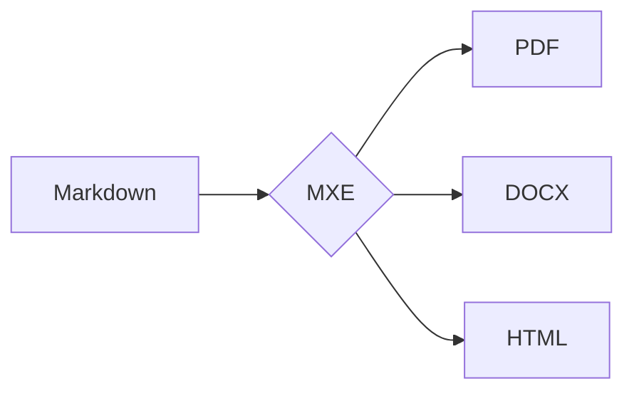

# MXE - Markdown Export Tool 📄

A powerful CLI for converting Markdown to PDF, DOCX, and HTML with Mermaid diagrams, syntax highlighting, and custom fonts.

## Features

- 📄 **Multiple formats**: PDF, DOCX, HTML, Clipboard
- 🎨 **Mermaid diagrams**: Flowcharts, sequence, class diagrams with ELK layout (default)
- 📊 **WaveDrom diagrams**: Digital timing diagrams, register definitions
- ✏️ **Hand-drawn style**: Sketch-like diagrams
- 🔤 **Custom fonts**: Inter, Roboto, Fira Code, JetBrains Mono, and more
- 🌈 **Syntax highlighting**: GitHub-style code blocks
- 📑 **Table of Contents**: Auto-generated TOC
- 🔖 **PDF Bookmarks**: Navigate large documents
- 🌐 **URL support**: Download web articles as Markdown
- 🖼️ **Image embedding**: Local images embedded in output

## Installation

```bash
npm install -g mxe
```

### Dependencies

For Mermaid diagram support, install mermaid-cli:
```bash
npm install -g @mermaid-js/mermaid-cli
```

## Usage

```bash
mxe <input> [options]
```

### Basic Examples

```bash
# Convert to PDF (default)
mxe document.md

# Convert to DOCX
mxe document.md -f docx

# Convert to HTML
mxe document.md -f html

# Download URL and convert
mxe https://example.com/article -f pdf
```

### Advanced Examples

```bash
# Full-featured PDF with TOC
mxe document.md --toc --font roboto --mono-font fira-code

# Hand-drawn Mermaid diagrams
mxe document.md --hand-draw --mermaid-theme forest

# Custom output directory
mxe document.md -o ./output

# With custom CSS
mxe document.md -s custom.css
```

## Options

| Option | Description |
|--------|-------------|
| `-f, --format <type>` | Output format: `pdf`, `docx`, `html`, `clipboard` |
| `-o, --output <dir>` | Output directory |
| `-s, --style <file>` | Custom CSS file |
| `--toc` | Generate table of contents |
| `--toc-depth <n>` | TOC heading depth (default: 3) |
| `--no-bookmarks` | Disable PDF bookmarks |

### Font Options

| Option | Description |
|--------|-------------|
| `--font <family>` | Body font family |
| `--mono-font <family>` | Code font family |

**Available fonts:**

| Font | Type | Description |
|------|------|-------------|
| `inter` | Sans | Modern, readable (default) |
| `roboto` | Sans | Google's clean font |
| `lato` | Sans | Friendly, warm |
| `opensans` | Sans | Neutral, legible |
| `source-sans` | Sans | Adobe's UI font |
| `merriweather` | Serif | Elegant reading |
| `jetbrains-mono` | Mono | Developer favorite (default) |
| `fira-code` | Mono | Ligatures support |
| `source-code` | Mono | Adobe's code font |

### Mermaid Options

| Option | Description |
|--------|-------------|
| `--mermaid-theme <theme>` | Theme: `default`, `forest`, `dark`, `neutral`, `base` |
| `--mermaid-layout <layout>` | Layout: `dagre`, `elk` |
| `--hand-draw` | Hand-drawn/sketch style |

## Examples

### Mermaid Diagram

````markdown

````

### Code Block

````markdown
```javascript
const hello = (name) => {
  console.log(`Hello, ${name}!`);
};
```
````

### WaveDrom Timing Diagram

````markdown
```wavedrom
{
  "signal": [
    { "name": "clk", "wave": "P........" },
    { "name": "data", "wave": "x.345678x", "data": ["D0", "D1", "D2", "D3", "D4", "D5"] },
    { "name": "enable", "wave": "0.1.....0" }
  ]
}
```
````

### WaveDrom Register Definition

````markdown
```wavedrom
{
  "reg": [
    { "name": "DATA", "bits": 8, "attr": "RW" },
    { "name": "STATUS", "bits": 4, "attr": "RO" },
    { "name": "reserved", "bits": 4, "type": 1 }
  ],
  "config": { "hspace": 600 }
}
```
````

## AI Tools Integration

MXE is designed to work seamlessly with AI assistants:

- Convert AI-generated content to professional PDFs
- Download research articles for AI processing
- Maintain documentation in Markdown format
- Export to various formats on demand

## License

ISC
