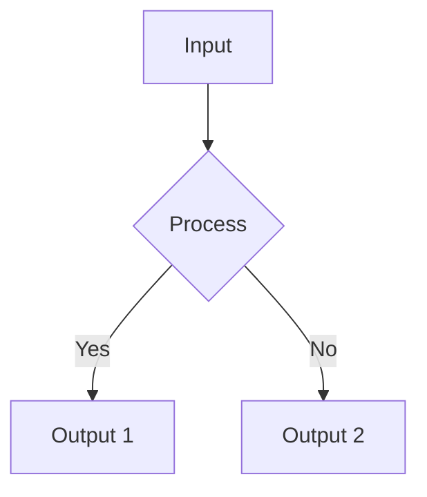
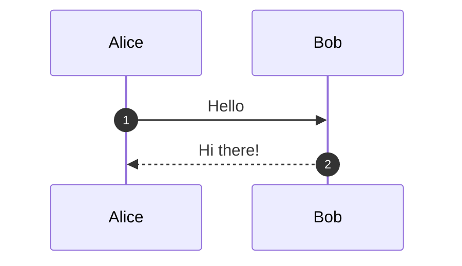
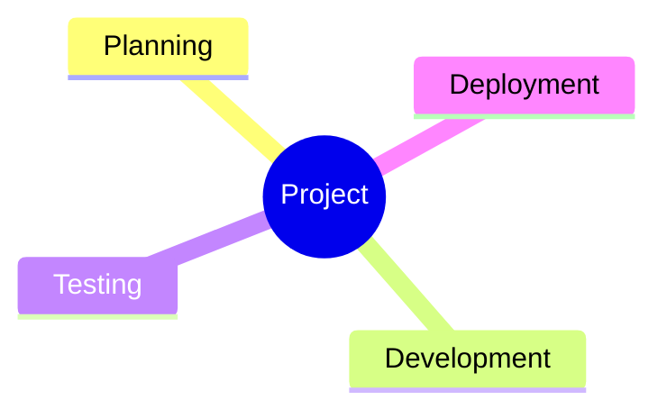

# MXE - Markdown Export Tool 📄

A powerful CLI for converting Markdown to PDF, DOCX, and HTML with diagrams, syntax highlighting, and custom fonts.

## Features

- 📄 **Multiple formats**: PDF, DOCX, HTML, Clipboard
- 🎨 **Mermaid v11.12**: 18+ diagram types with ELK layout
- 📊 **WaveDrom**: Digital timing diagrams, register definitions
- ✏️ **Hand-drawn style**: Sketch-like diagrams
- 🔤 **Custom fonts**: Inter, Roboto, Fira Code, JetBrains Mono, and more
- 🌈 **Syntax highlighting**: GitHub-style code blocks
- 📑 **Table of Contents**: Auto-generated TOC
- 🔖 **PDF Bookmarks**: Navigate large documents
- 🌐 **URL support**: Download web articles as Markdown
- 🖼️ **Image embedding**: Local images embedded in output

## Installation

```bash
npm install -g mxe
```

That's it! No additional dependencies required. MXE uses Puppeteer to render diagrams server-side.

## Usage

```bash
mxe <input> [options]
```

### Basic Examples

```bash
# Convert to PDF (default)
mxe document.md

# With table of contents
mxe document.md --toc

# Convert to DOCX
mxe document.md -f docx

# Convert to HTML
mxe document.md -f html

# Download URL and convert
mxe https://example.com/article -f pdf
```

### Advanced Examples

```bash
# Full-featured PDF with custom fonts
mxe document.md --toc --font roboto --mono-font fira-code

# Hand-drawn Mermaid diagrams
mxe document.md --hand-draw --mermaid-theme forest

# Custom output path
mxe document.md -o ./output/my-doc.pdf

# With custom CSS
mxe document.md -s custom.css
```

## Options

| Option | Description |
|--------|-------------|
| `-f, --format <type>` | Output format: `pdf`, `docx`, `html`, `clipboard` |
| `-o, --output <path>` | Output file path |
| `-s, --style <file>` | Custom CSS file |
| `--toc` | Generate table of contents |
| `--toc-depth <n>` | TOC heading depth (default: 3) |
| `--no-bookmarks` | Disable PDF bookmarks |

### Font Options

| Option | Description |
|--------|-------------|
| `--font <family>` | Body font family |
| `--mono-font <family>` | Code font family |

**Available fonts:**

| Font | Type | Description |
|------|------|-------------|
| `inter` | Sans | Modern, readable (default) |
| `roboto` | Sans | Google's clean font |
| `lato` | Sans | Friendly, warm |
| `opensans` | Sans | Neutral, legible |
| `source-sans` | Sans | Adobe's UI font |
| `merriweather` | Serif | Elegant reading |
| `jetbrains-mono` | Mono | Developer favorite (default) |
| `fira-code` | Mono | Ligatures support |
| `source-code` | Mono | Adobe's code font |

### Diagram Options

| Option | Description |
|--------|-------------|
| `--mermaid-theme <theme>` | Theme: `default`, `forest`, `dark`, `neutral`, `base` |
| `--mermaid-layout <layout>` | Layout: `elk` (default), `dagre` |
| `--hand-draw` | Hand-drawn/sketch style |

## Supported Diagrams

### Mermaid (v11.12)

MXE supports all 18+ Mermaid diagram types:

| Diagram | Description |
|---------|-------------|
| Flowchart | Process flows, decision trees |
| Sequence | Interaction between components |
| Class | Object-oriented design |
| State | State machines |
| ER Diagram | Database relationships |
| Gantt | Project timelines |
| Pie Chart | Data distribution |
| Git Graph | Branch visualization |
| Mindmap | Hierarchical ideas |
| Timeline | Historical events |
| Quadrant | Priority matrices |
| Sankey | Flow quantities |
| XY Chart | Bar/line charts |
| Block | Block diagrams |
| Requirement | Requirements tracing |
| User Journey | User experience flows |
| C4 | Software architecture |
| ZenUML | Sequence (alternative) |

### WaveDrom

Digital timing diagrams and register definitions for hardware documentation.

## Examples

### Flowchart with ELK Layout

````markdown

````

### Sequence Diagram

````markdown

````

### Mindmap

````markdown

````

### WaveDrom Timing

````markdown
```wavedrom
{
  "signal": [
    { "name": "clk", "wave": "P........" },
    { "name": "data", "wave": "x.345678x", "data": ["D0", "D1", "D2", "D3", "D4", "D5"] },
    { "name": "enable", "wave": "0.1.....0" }
  ]
}
```
````

### WaveDrom Register

````markdown
```wavedrom
{
  "reg": [
    { "name": "DATA", "bits": 8, "attr": "RW" },
    { "name": "STATUS", "bits": 4, "attr": "RO" },
    { "name": "reserved", "bits": 4, "type": 1 }
  ]
}
```
````

### Code Block

````markdown
```typescript
const greet = (name: string): void => {
  console.log(`Hello, ${name}!`);
};
```
````

## AI Tools Integration

MXE is designed to work seamlessly with AI assistants:

- Convert AI-generated content to professional PDFs
- Download research articles for AI processing  
- Maintain documentation in Markdown format
- Export to various formats on demand

## Changelog

### v2.1.2
- Default to ELK layout for Mermaid diagrams
- Better automatic node positioning

### v2.1.0
- Added WaveDrom support (timing diagrams, registers)
- Inline SVG rendering (no external dependencies)

### v2.0.0
- Mermaid v11.12 with all diagram types
- Custom font support
- PDF bookmarks and TOC
- Hand-drawn diagram style

## License

ISC
