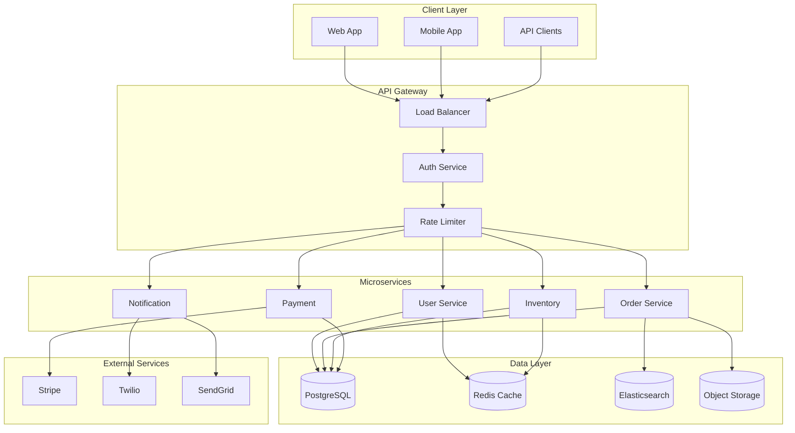
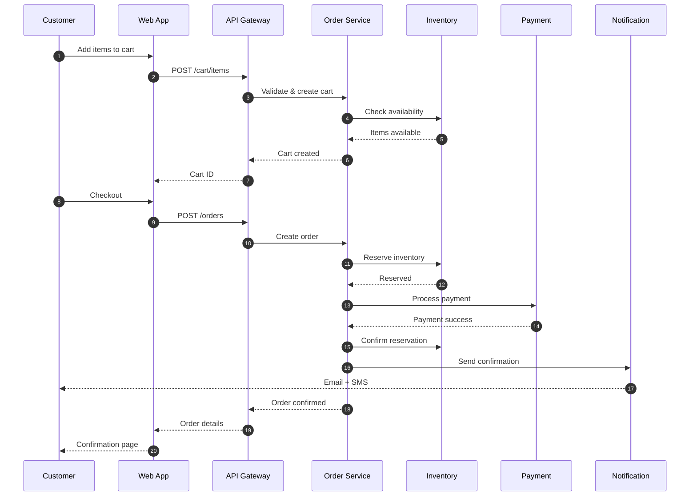
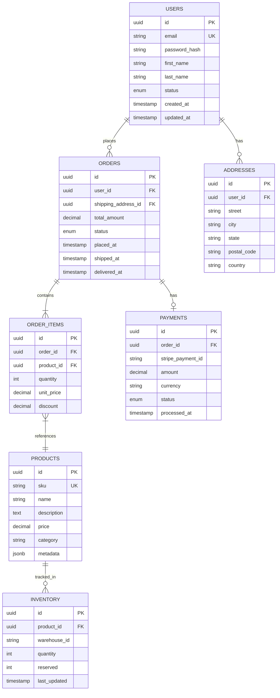
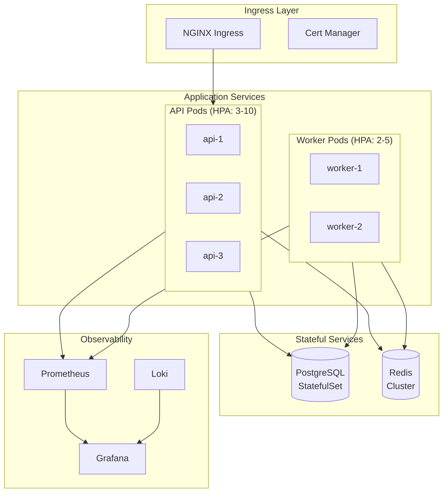
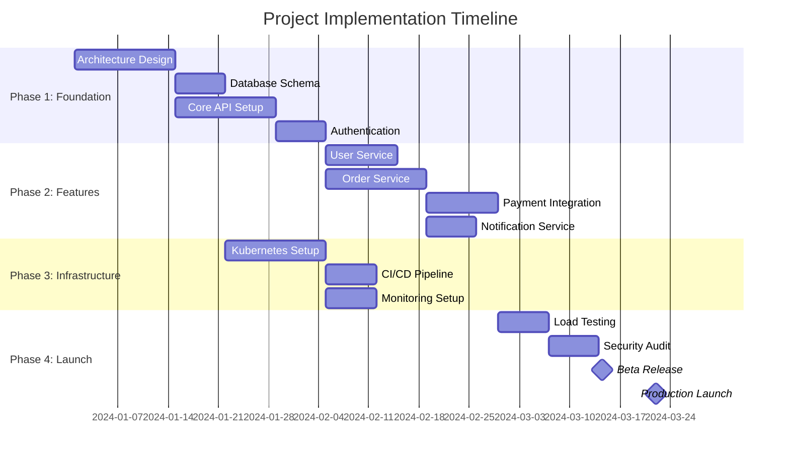
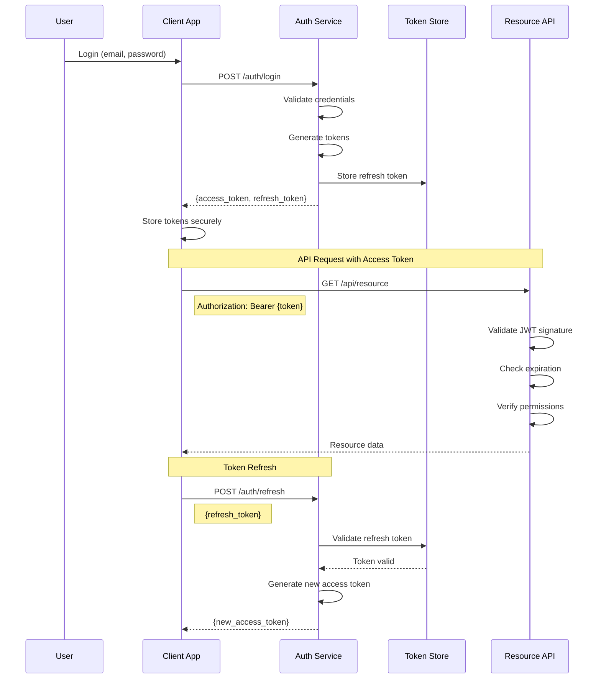

# MXE Complex Document Test

> This document tests all MXE features in a real-world scenario.

## 1. Executive Summary

This comprehensive technical specification demonstrates **MXE's capabilities** for generating professional PDF documents from Markdown. It includes complex diagrams, detailed tables, code samples, and extensive textual content typical of enterprise documentation.

---

## 2. System Architecture

### 2.1 High-Level Overview



### 2.2 Sequence Diagram - Order Flow



---

## 3. Hardware Specifications

### 3.1 SPI Communication Protocol

```wavedrom
{
  "signal": [
    { "name": "CLK", "wave": "p.........", "period": 1 },
    { "name": "CS", "wave": "10.......1" },
    { "name": "MOSI", "wave": "x.2345678x", "data": ["D7", "D6", "D5", "D4", "D3", "D2", "D1", "D0"] },
    { "name": "MISO", "wave": "x.=.=.=.=x", "data": ["R7", "R5", "R3", "R1"] }
  ],
  "config": { "hscale": 1.5 }
}
```

### 3.2 I2C Bus Timing

```wavedrom
{
  "signal": [
    { "name": "SCL", "wave": "1.0.1.0.1.0.1.0.1.0.1" },
    { "name": "SDA", "wave": "1.0...=.=.=.=.=.=.1.", "data": ["A6", "A5", "A4", "A3", "A2", "A1", "A0"] },
    { "name": "State", "wave": "x.=...........=...=x", "data": ["START", "ADDR", "ACK"] }
  ]
}
```

### 3.3 Register Map

```wavedrom
{
  "reg": [
    { "name": "CTRL", "bits": 8, "attr": "RW", "type": 0 },
    { "name": "STATUS", "bits": 8, "attr": "RO", "type": 2 },
    { "name": "DATA_LOW", "bits": 8, "attr": "RW", "type": 0 },
    { "name": "DATA_HIGH", "bits": 8, "attr": "RW", "type": 0 },
    { "name": "reserved", "bits": 32, "type": 1 }
  ],
  "config": { "hspace": 800 }
}
```

---

## 4. API Specifications

### 4.1 Endpoint Overview

| Endpoint | Method | Description | Auth | Rate Limit | Cache TTL |
|----------|--------|-------------|------|------------|-----------|
| `/api/v1/users` | GET | List all users with pagination | Bearer Token | 100/min | 5 min |
| `/api/v1/users/{id}` | GET | Get user by ID | Bearer Token | 200/min | 10 min |
| `/api/v1/users` | POST | Create new user | Bearer Token | 20/min | None |
| `/api/v1/users/{id}` | PUT | Update user | Bearer Token | 50/min | Invalidate |
| `/api/v1/users/{id}` | DELETE | Delete user (soft) | Admin Token | 10/min | Invalidate |
| `/api/v1/orders` | GET | List orders with filters | Bearer Token | 100/min | 2 min |
| `/api/v1/orders/{id}` | GET | Get order details | Bearer Token | 200/min | 5 min |
| `/api/v1/orders` | POST | Create new order | Bearer Token | 30/min | None |
| `/api/v1/orders/{id}/status` | PATCH | Update order status | Service Token | 100/min | Invalidate |
| `/api/v1/products` | GET | List products | Public | 500/min | 15 min |
| `/api/v1/products/{id}` | GET | Get product details | Public | 1000/min | 30 min |
| `/api/v1/inventory` | GET | Check inventory levels | Service Token | 200/min | 1 min |

### 4.2 Response Codes

| Code | Status | Description | Common Causes | Recommended Action |
|------|--------|-------------|---------------|-------------------|
| 200 | OK | Request successful | N/A | Process response |
| 201 | Created | Resource created | N/A | Use Location header |
| 204 | No Content | Deleted successfully | N/A | Confirm deletion |
| 400 | Bad Request | Invalid request format | Missing fields, invalid JSON, wrong data types | Check request body against schema |
| 401 | Unauthorized | Authentication failed | Expired token, missing token, invalid credentials | Refresh token or re-authenticate |
| 403 | Forbidden | Insufficient permissions | Role-based access denied, resource ownership | Check user permissions |
| 404 | Not Found | Resource doesn't exist | Wrong ID, deleted resource | Verify resource ID |
| 409 | Conflict | Resource state conflict | Duplicate entry, concurrent modification | Retry with fresh data |
| 422 | Unprocessable | Business logic error | Insufficient inventory, payment declined | Handle specific error code |
| 429 | Too Many Requests | Rate limit exceeded | Too many API calls | Implement exponential backoff |
| 500 | Server Error | Internal error | Bug, infrastructure issue | Retry with backoff, contact support |
| 503 | Service Unavailable | Service down | Deployment, maintenance | Retry after Retry-After header |

---

## 5. Database Schema

### 5.1 Entity Relationship Diagram



### 5.2 Table Specifications

| Table | Columns | Indexes | Est. Rows | Growth Rate | Partitioning |
|-------|---------|---------|-----------|-------------|--------------|
| users | 12 | 3 (id, email, status) | 500K | 10K/month | None |
| orders | 15 | 5 (id, user_id, status, placed_at, total) | 2M | 100K/month | By placed_at (monthly) |
| order_items | 8 | 3 (id, order_id, product_id) | 8M | 400K/month | By order_id range |
| products | 14 | 4 (id, sku, category, price) | 50K | 1K/month | None |
| inventory | 7 | 3 (id, product_id, warehouse) | 200K | 5K/month | By warehouse_id |
| payments | 10 | 4 (id, order_id, stripe_id, status) | 2M | 100K/month | By processed_at |
| addresses | 9 | 2 (id, user_id) | 800K | 15K/month | None |
| audit_logs | 8 | 3 (id, table_name, created_at) | 50M | 5M/month | By created_at (daily) |

---

## 6. Implementation Details

### 6.1 User Service Implementation

```typescript
import { Injectable, NotFoundException } from '@nestjs/common';
import { InjectRepository } from '@nestjs/typeorm';
import { Repository } from 'typeorm';
import { User } from './entities/user.entity';
import { CreateUserDto, UpdateUserDto } from './dto';
import { RedisService } from '../cache/redis.service';

@Injectable()
export class UserService {
  private readonly CACHE_TTL = 600; // 10 minutes

  constructor(
    @InjectRepository(User)
    private readonly userRepository: Repository<User>,
    private readonly redisService: RedisService,
  ) {}

  async findById(id: string): Promise<User> {
    // Try cache first
    const cached = await this.redisService.get(`user:${id}`);
    if (cached) {
      return JSON.parse(cached);
    }

    // Query database
    const user = await this.userRepository.findOne({
      where: { id },
      relations: ['addresses', 'orders'],
    });

    if (!user) {
      throw new NotFoundException(`User with ID ${id} not found`);
    }

    // Cache result
    await this.redisService.set(
      `user:${id}`,
      JSON.stringify(user),
      this.CACHE_TTL
    );

    return user;
  }

  async create(dto: CreateUserDto): Promise<User> {
    const user = this.userRepository.create({
      ...dto,
      status: 'active',
      createdAt: new Date(),
    });

    return this.userRepository.save(user);
  }

  async update(id: string, dto: UpdateUserDto): Promise<User> {
    const user = await this.findById(id);
    
    Object.assign(user, dto, { updatedAt: new Date() });
    
    const updated = await this.userRepository.save(user);
    
    // Invalidate cache
    await this.redisService.del(`user:${id}`);
    
    return updated;
  }
}
```

### 6.2 Python Data Pipeline

```python
import asyncio
from dataclasses import dataclass
from typing import List, Optional
from datetime import datetime
import pandas as pd
from sqlalchemy.ext.asyncio import AsyncSession

@dataclass
class OrderMetrics:
    """Daily order metrics for analytics dashboard."""
    date: datetime
    total_orders: int
    total_revenue: float
    avg_order_value: float
    unique_customers: int
    top_category: str
    conversion_rate: float

class AnalyticsPipeline:
    """ETL pipeline for order analytics."""
    
    def __init__(self, session: AsyncSession):
        self.session = session
        self.batch_size = 1000
    
    async def extract_orders(
        self, 
        start_date: datetime,
        end_date: datetime
    ) -> pd.DataFrame:
        """Extract orders within date range."""
        query = """
            SELECT 
                o.id,
                o.user_id,
                o.total_amount,
                o.status,
                o.placed_at,
                p.category
            FROM orders o
            JOIN order_items oi ON o.id = oi.order_id
            JOIN products p ON oi.product_id = p.id
            WHERE o.placed_at BETWEEN :start AND :end
            AND o.status = 'completed'
        """
        
        result = await self.session.execute(
            query, 
            {"start": start_date, "end": end_date}
        )
        
        return pd.DataFrame(result.fetchall())
    
    def transform(self, df: pd.DataFrame) -> List[OrderMetrics]:
        """Aggregate orders into daily metrics."""
        daily = df.groupby(df['placed_at'].dt.date).agg({
            'id': 'count',
            'total_amount': ['sum', 'mean'],
            'user_id': 'nunique',
            'category': lambda x: x.mode().iloc[0]
        })
        
        return [
            OrderMetrics(
                date=date,
                total_orders=row['id']['count'],
                total_revenue=row['total_amount']['sum'],
                avg_order_value=row['total_amount']['mean'],
                unique_customers=row['user_id']['nunique'],
                top_category=row['category']['<lambda>'],
                conversion_rate=self._calc_conversion(date)
            )
            for date, row in daily.iterrows()
        ]
```

---

## 7. Deployment Architecture

### 7.1 Kubernetes Deployment



### 7.2 Infrastructure Requirements

| Component | CPU | Memory | Storage | Replicas | Cost/Month |
|-----------|-----|--------|---------|----------|------------|
| API Server | 2 cores | 4 GB | 20 GB SSD | 3-10 (HPA) | $150-500 |
| Worker | 4 cores | 8 GB | 50 GB SSD | 2-5 (HPA) | $200-500 |
| PostgreSQL Primary | 8 cores | 32 GB | 500 GB NVMe | 1 | $400 |
| PostgreSQL Replica | 4 cores | 16 GB | 500 GB NVMe | 2 | $400 |
| Redis Cluster | 2 cores | 8 GB | 50 GB SSD | 6 nodes | $300 |
| Elasticsearch | 4 cores | 16 GB | 200 GB SSD | 3 nodes | $450 |
| Monitoring Stack | 2 cores | 4 GB | 100 GB SSD | 1 | $100 |
| **Total (minimum)** | **36 cores** | **124 GB** | **1.9 TB** | - | **~$2,500** |

---

## 8. Performance Benchmarks

### 8.1 Load Test Results

| Scenario | Concurrent Users | RPS | Avg Latency | P95 Latency | P99 Latency | Error Rate |
|----------|-----------------|-----|-------------|-------------|-------------|------------|
| Read (GET /users) | 100 | 2,500 | 12ms | 25ms | 45ms | 0.01% |
| Read (GET /users) | 500 | 8,000 | 18ms | 40ms | 80ms | 0.05% |
| Read (GET /users) | 1000 | 12,000 | 35ms | 85ms | 150ms | 0.2% |
| Write (POST /orders) | 100 | 500 | 45ms | 80ms | 120ms | 0.1% |
| Write (POST /orders) | 500 | 1,800 | 85ms | 150ms | 250ms | 0.5% |
| Mixed (70R/30W) | 500 | 4,500 | 35ms | 75ms | 130ms | 0.15% |
| Mixed (70R/30W) | 1000 | 7,200 | 55ms | 120ms | 200ms | 0.3% |
| Spike (0→1000 in 10s) | 1000 | 6,000 | 80ms | 200ms | 400ms | 1.2% |

### 8.2 Gantt Chart - Implementation Timeline



---

## 9. Security Considerations

### 9.1 Authentication Flow



### 9.2 Security Checklist

| Category | Control | Status | Priority | Notes |
|----------|---------|--------|----------|-------|
| **Authentication** | JWT with RS256 | ✅ Implemented | Critical | 15-minute expiry |
| | Refresh token rotation | ✅ Implemented | Critical | Single-use tokens |
| | MFA support | 🔄 In Progress | High | TOTP-based |
| | Brute force protection | ✅ Implemented | Critical | 5 attempts, 15 min lockout |
| **Authorization** | RBAC implementation | ✅ Implemented | Critical | 5 role levels |
| | Resource-level permissions | ✅ Implemented | High | Owner/admin checks |
| | API scope restrictions | ✅ Implemented | Medium | Per-client scopes |
| **Data Protection** | Encryption at rest | ✅ Implemented | Critical | AES-256-GCM |
| | Encryption in transit | ✅ Implemented | Critical | TLS 1.3 only |
| | PII masking in logs | ✅ Implemented | High | Structured logging |
| | Data retention policy | 🔄 In Progress | Medium | 90-day default |
| **Infrastructure** | WAF enabled | ✅ Implemented | High | AWS WAF |
| | DDoS protection | ✅ Implemented | High | Cloudflare |
| | Secret management | ✅ Implemented | Critical | HashiCorp Vault |
| | Container scanning | ✅ Implemented | High | Trivy in CI |

---

## 10. Appendix

### 10.1 Glossary

| Term | Definition |
|------|------------|
| **API Gateway** | A server that acts as an API front-end, receiving API requests, enforcing throttling and security policies, passing requests to the back-end service, and then passing the response back to the requester. |
| **Bearer Token** | A type of access token that is included in the Authorization header of HTTP requests. The term "bearer" implies that any party in possession of the token can use it. |
| **Circuit Breaker** | A design pattern used in distributed systems to detect failures and prevent cascading failures across multiple services. When failures reach a threshold, the circuit "opens" and fails fast. |
| **CQRS** | Command Query Responsibility Segregation - a pattern that separates read and write operations for a data store, allowing for optimization of each operation type independently. |
| **Event Sourcing** | A pattern where state changes are logged as a sequence of events. The current state can be reconstructed by replaying all events from the beginning. |
| **HPA** | Horizontal Pod Autoscaler - a Kubernetes resource that automatically scales the number of pods in a deployment based on observed CPU utilization or custom metrics. |
| **Idempotency** | The property of an operation that produces the same result whether executed once or multiple times. Critical for reliable API design and retry mechanisms. |
| **JWT** | JSON Web Token - a compact, URL-safe means of representing claims to be transferred between two parties, commonly used for authentication and authorization. |
| **Saga Pattern** | A sequence of local transactions where each transaction updates data within a single service. Used to maintain data consistency across services without distributed transactions. |
| **Sharding** | A database partitioning technique that splits data horizontally across multiple database instances based on a sharding key. |

### 10.2 References

1. Fowler, M. (2002). *Patterns of Enterprise Application Architecture*. Addison-Wesley.
2. Newman, S. (2021). *Building Microservices*, 2nd Edition. O'Reilly Media.
3. Kleppmann, M. (2017). *Designing Data-Intensive Applications*. O'Reilly Media.
4. Burns, B. (2018). *Designing Distributed Systems*. O'Reilly Media.
5. Richardson, C. (2018). *Microservices Patterns*. Manning Publications.

---

*Document generated with MXE v2.1.1 — Markdown to PDF with embedded diagrams*
