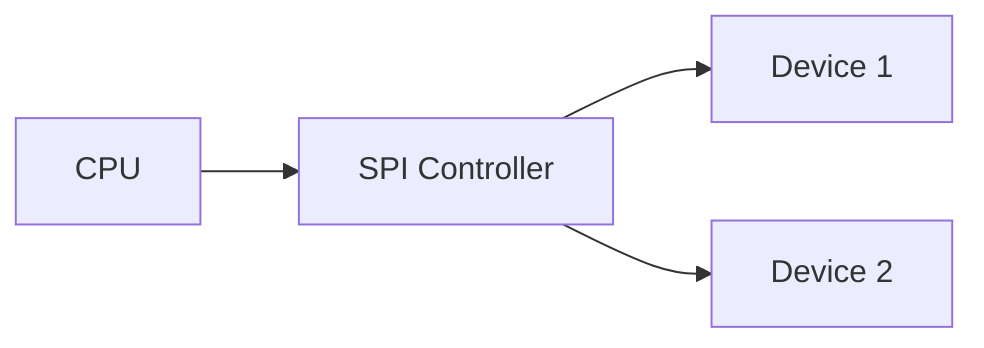

# MXE Diagram Test - WaveDrom

This document tests WaveDrom digital timing diagrams support.

## Basic Timing Diagram

```wavedrom
{ 
  "signal": [
    { "name": "clk", "wave": "p......." },
    { "name": "data", "wave": "x.345x..", "data": ["A", "B", "C"] },
    { "name": "req", "wave": "0.1..0.." },
    { "name": "ack", "wave": "1....01." }
  ]
}
```

## SPI Interface

```wavedrom
{
  "signal": [
    { "name": "SCK", "wave": "0.P......P" },
    { "name": "MOSI", "wave": "x.345678x.", "data": ["D7", "D6", "D5", "D4", "D3", "D2", "D1", "D0"] },
    { "name": "MISO", "wave": "x.=.=.=.=x", "data": ["R7", "R6", "R5", "R4"] },
    { "name": "SS", "wave": "10.......1" }
  ],
  "config": { "hscale": 1 }
}
```

## Register Description

```wavedrom
{
  "reg": [
    { "name": "DATA", "bits": 8, "attr": "RW" },
    { "name": "ADDR", "bits": 16, "attr": "RW" },
    { "name": "STATUS", "bits": 4, "attr": "RO" },
    { "name": "reserved", "bits": 4, "type": 1 }
  ],
  "config": { "hspace": 600 }
}
```

## Also supports Mermaid



## Conclusion

MXE now supports both Mermaid and WaveDrom diagrams for comprehensive technical documentation.
