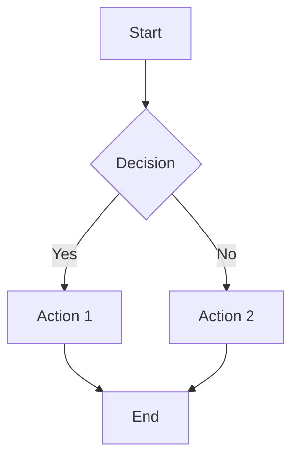
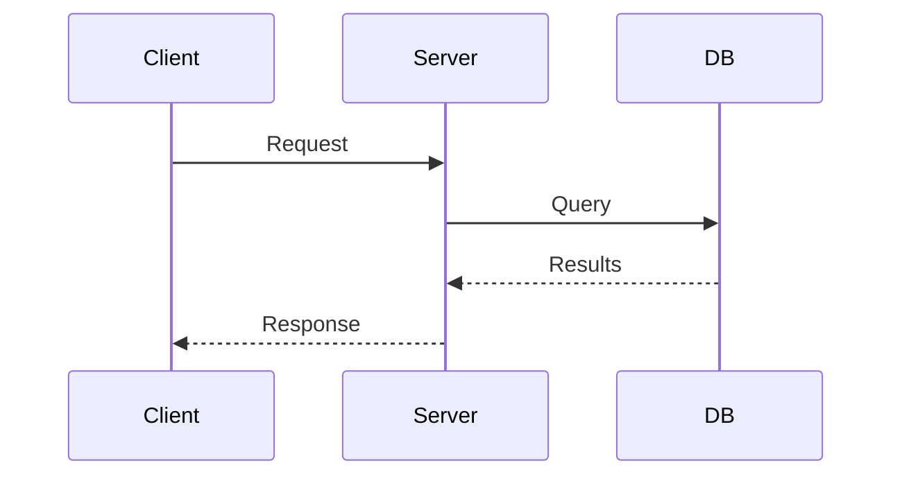
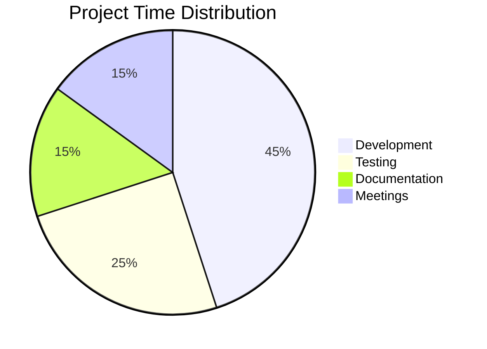
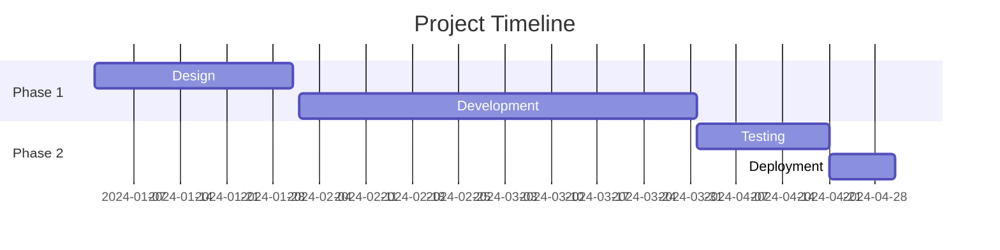

# Mermaid Diagrams Test

## Flowchart

```mermaid
flowchart TD
    A[Start] --> B{Decision}
    B -->|Yes| C[Action 1]
    B -->|No| D[Action 2]
    C --> E[End]
    D --> E
```

## Sequence Diagram

```mermaid
sequenceDiagram
    participant Client
    participant Server
    participant DB
    Client->>Server: Request
    Server->>DB: Query
    DB-->>Server: Results
    Server-->>Client: Response
```

## Pie Chart

```mermaid
pie title Project Time Distribution
    "Development" : 45
    "Testing" : 25
    "Documentation" : 15
    "Meetings" : 15
```

## Gantt Chart

```mermaid
gantt
    title Project Timeline
    dateFormat  YYYY-MM-DD
    section Phase 1
    Design           :2024-01-01, 30d
    Development      :2024-02-01, 60d
    section Phase 2
    Testing          :2024-04-01, 20d
    Deployment       :2024-04-21, 10d
```
