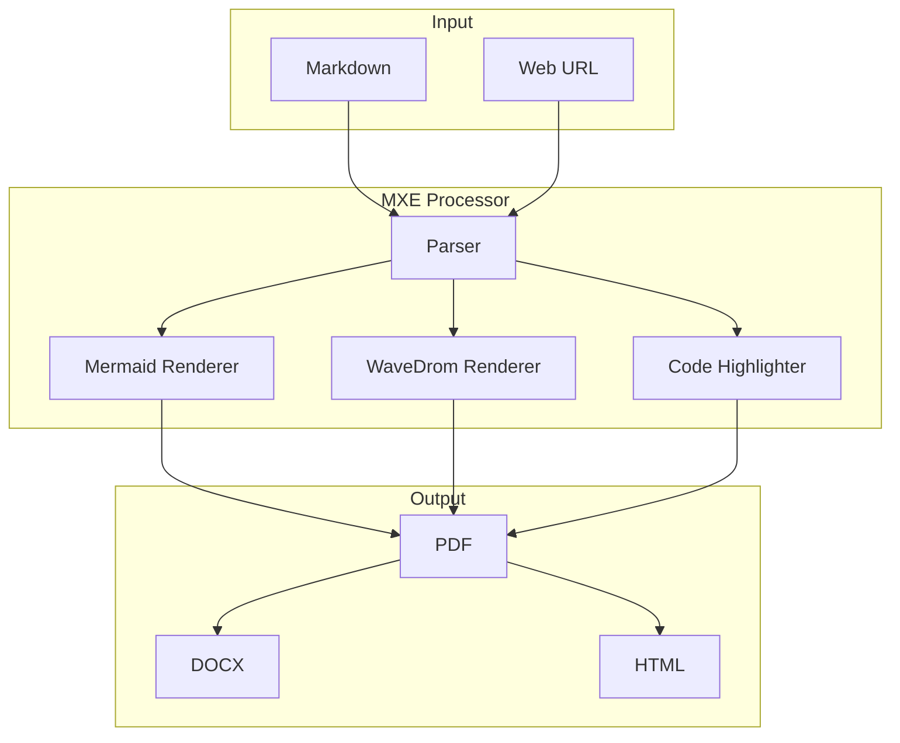
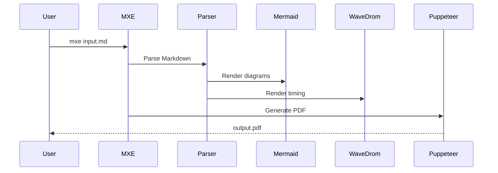

# Mixed Content Test

[TOC]

## Introduction

This document demonstrates **all MXE features** in a single file.

## Architecture Diagram



## Hardware Interface

```wavedrom
{
  "signal": [
    { "name": "clk", "wave": "P......." },
    { "name": "addr", "wave": "x.345x..", "data": ["A0", "A1", "A2"] },
    { "name": "data", "wave": "x..345x.", "data": ["D0", "D1", "D2"] },
    { "name": "we", "wave": "0..1..0." }
  ],
  "head": { "text": "Memory Write Cycle" }
}
```

## Implementation

```typescript
import { MXE } from 'mxe';

const converter = new MXE({
  format: 'pdf',
  toc: true,
  mermaidTheme: 'default'
});

await converter.convert('input.md', 'output.pdf');
```

## Feature Matrix

| Feature | PDF | HTML | DOCX |
|---------|:---:|:----:|:----:|
| Mermaid | ✅ | ✅ | ✅ |
| WaveDrom | ✅ | ✅ | ⚠️ |
| TOC | ✅ | ✅ | ✅ |
| Code Highlight | ✅ | ✅ | ✅ |
| Bookmarks | ✅ | - | - |

## Sequence Flow



## Conclusion

MXE provides a **comprehensive** solution for technical documentation with support for:

1. Multiple diagram types
2. Code highlighting
3. Professional PDF output
4. Cross-platform compatibility
